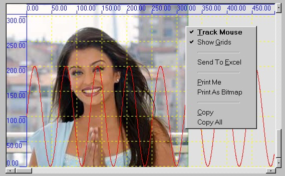

<div align="center">

## Ashu Graph Control Version 2


</div>

### Description

I tried to remove all bugs from my previous submission. And now it can draw also negative points.

Now it supports property pages & popUpMenu. It can send to data to Excel . It can

save data in text file and further can read from text file.It can copy graphs to clipboard as bitmaps.

Plot more than one Graphs , Can Print them, you can customize the colors of graph and scales

u can scroll graph , can track mouse points, can draw gridlines.

Zip file includes a html and a text file describing how to use this control.
 
### More Info
 
AshuGraph Control

I tried to remove all bugs from my previous submission. And now it can draw also negative points.

Now it supports property pages & popUpMenu. It can send to data to Excel . It can

save data in text file and further can read from text file.It can copy graphs to clipboard as bitmaps.

Plot more than one Graphs , Can Print them, you can customize the colors of graph and scales

u can scroll graph , can track mouse points, can draw gridlines.

An excellent graph control with its limitations. user draw graph in own units (whatever it may)

How to use :

1. Initalization: Set Simple Properties in design mode

BackColor : backcolor of graph control

Font : font in which scales(horizontal & vetical) will be dispalyed

Forecolor : decides the colors of scales (horizontal & vertical)

GridColor: decides the color of grids if ShowGrids prperty is true

TooltipBkColor : used to track & display data points(X,Y) as tooltip when mouse moves over graph and TrackMousePointer property is true

ToolTipForeColor : same as above

TrackMousePointer : whether track points when mouse move, i.e. when mouse move datapoints (x,y) should be displayed at location of mouse pointer

can be changed in run time

XGap ,YGap : in user units, the interval on scales(horizontal & vertical) at which values are marked

XMinPosition ,YMinPosition:in user units, Minimum position of scales , should not negative, usually 0.00

XUnitToPixel, YUnitToPixels: how to map user units to pixels, i.e., 1 user unit in X direction = ? pixels

for example, user can map 1 meter/second to 2 pixels , if speed is in vertical direction , by setting m_YUnitToPixels = 2

XScaleHeight ,YScaleWidth: user can change the scales ' width , depening upon font & font sizes he uses for scales

2. Initialization at run time

NOTE:

Presently maximum limit on No of Graphs you can draw in control is 5 and you can change it by

changing the value of constant MAX_NO_OF_GRAPHS in source code

InitializeMe :call it when your program strats or when you want to remove all graphs from control, if you are removing graphs , then

after calling it, call invalidate()

3.How to Add a Graph ?

3.1 First find the free index of graph by calling GetFreeGraph

e.g. dim index as long

index = ashugraphcontrol1. Getfreegraph

On failure it returns -1, it means you cannot draw more graphs in control.

3.2 now add points to graph by calling AddData()

e.g.

for i = 1 to 200

'calculate x and y

ashugraphcontrol1.AddData(x,y,index)

3.3 now set color and drawstyle

e.g.

ashugraphcontrol1.SetColor(color,index) '''color = rgb(200,200,0)

ashugraphcontrol1.SetDrawStyle(index,drawstyle)

''''DrawStyle 0 means draw points as pixels (default)

''''drawstyle 1 means join points using lines (line clipping doesn't support)

''''drawstyle 2 means draw points as square

''''drawstyle 3 means draw points as square and join them by lines

'''' any other values keep graph invisible

3.4 now call invalidate() to update control

ashugraphcontrol1.Invalidate

Functions:

Invalidate(): always call, when u make any cahnges in graphs , i.e. adding a point to graph, deleting a graph, changing a point of graph

it refreshes graph control with new values

SetColor( color in rgb, graph no) : display a graph ( graph no ) with specified color

AddData(x,y,graphNO) : add point x,y to graph no graphNo

GetData(x,y,index,graphNo): retrieve the data x,y from graph graphNo, at specific index ( index in which order you added the data)

if success return true

SetData(x,y,index,graphNo): change the data x,y at specific index in graph graphNo ; cannot be used to add data to graph

(Index - in which order you added data to this graph) if success return true

RemoveGraph(graphNo) : doesn't display graph , you can use this graphNo to add new graph to control, after using this call Invalidate

DrawStyle(graphno, drawstyle);''''DrawStyle 0 means draw points as pixels

''''drawstyle 1 means join points using lines (line clipping doesn't support)

''''drawstyle 2 means draw points as square

''''drawstyle 3 means draw points as square and join them by lines

SaveGraphInTextFile(GraphNo,filename): save graph indexed by graphno in file named by filename

ReadGraphFromTextFile(fielname,resetsetting as boolean): read one graph from a file and second parameter decide whether to reset setting of controls according to new graph or not

usually , we pass false, we should pass true when there is no other graph is in the control.

It returns the index of new graph.

SendToExcel(): Sends All Data to graph in following format

graph0  graph1  graph2 .....

x y x y  x y ........

DrawDerivativeForGraph(graphno) : try to draw derivative of graph graphno , No efficient, returns index of new graph

SetName(name, graphNo): Assigns a name to a graph ; the name will be used to identify graph in MS-excel.

ShowBusyMessage(true/false): it will show "Busy..." on control during lenghty operations.

Printing:

PrintSetting(leftMargin in Pixels, top Margins in Pixels,Header for graph , label for x axis, label for y axis, variable to decide to print page no( 0 for don't print , 1 for print on top, 2 for print on bottom),zoom factor for zooming printing of graph ( in percentage, for simple printing value should be 100),PaperSize = 9 for A4 size ; = 10 for A4 small size; = 1 for letter size ; = 8 for A3 size; = 11 for a5 size(for more see help on "printer" object in vb editor, print quality = -1 for draft printting and = - 4 for high resolution)

PrintMe() : to print graph from your default printer


<span>             |<span>
---                |---
**Submitted On**   |2002-07-08 11:50:02
**By**             |[Ashutosh Upadhyay](https://github.com/Planet-Source-Code/PSCIndex/blob/master/ByAuthor/ashutosh-upadhyay.md)
**Level**          |Intermediate
**User Rating**    |4.6 (51 globes from 11 users)
**Compatibility**  |VB 6\.0
**Category**       |[OLE/ COM/ DCOM/ Active\-X](https://github.com/Planet-Source-Code/PSCIndex/blob/master/ByCategory/ole-com-dcom-active-x__1-29.md)
**World**          |[Visual Basic](https://github.com/Planet-Source-Code/PSCIndex/blob/master/ByWorld/visual-basic.md)
**Archive File**   |[Ashu\_Graph103315782002\.zip](https://github.com/Planet-Source-Code/ashutosh-upadhyay-ashu-graph-control-version-2__1-36451/archive/master.zip)

### API Declarations

```
Public Declare Function SelectObject Lib "gdi32" (ByVal hdc As Long, ByVal hObject As Long) As Long
Public Declare Function MulDiv Lib "kernel32" (ByVal nNumber As Long, ByVal nNumerator As Long, ByVal nDenominator As Long) As Long
Public Declare Function GetDeviceCaps Lib "gdi32" (ByVal hdc As Long, ByVal nIndex As Long) As Long
Public Declare Function DeleteObject Lib "gdi32" (ByVal hObject As Long) As Long
Public Declare Function TextOut Lib "gdi32" Alias "TextOutA" (ByVal hdc As Long, ByVal X As Long, ByVal Y As Long, ByVal lpString As String, ByVal nCount As Long) As Long
 Long, ByVal F As String) As Long
Public Declare Function SetPixelV Lib "gdi32" (ByVal hdc As Long, ByVal X As Long, ByVal Y As Long, ByVal crColor As Long) As Long
Public Declare Function GetPixel Lib "gdi32" (ByVal hdc As Long, ByVal X As Long, ByVal Y As Long) As Long
Public Declare Function LineTo Lib "gdi32" (ByVal hdc As Long, ByVal X As Long, ByVal Y As Long) As Long
Public Declare Function MoveToEx Lib "gdi32" (ByVal hdc As Long, ByVal X As Long, ByVal Y As Long, lpPoint As POINTAPI) As Long
Public Declare Function SetTextColor Lib "gdi32" (ByVal hdc As Long, ByVal crColor As Long) As Long
Public Declare Function AbortDoc Lib "gdi32" (ByVal hdc As Long) As Long
Public Declare Function Escape Lib "gdi32" (ByVal hdc As Long, ByVal nEscape As Long, ByVal nCount As Long, lpInData As Any, lpOutData As Any) As Long
Public Declare Function CreateCompatibleDC Lib "gdi32" (ByVal hdc As Long) As Long
Public Declare Function StretchBlt Lib "gdi32" (ByVal hdc As Long, ByVal X As Long, ByVal Y As Long, ByVal nWidth As Long, ByVal nHeight As Long, ByVal hSrcDC As Long, ByVal xSrc As Long, ByVal ySrc As Long, ByVal nSrcWidth As Long, ByVal nSrcHeight As Long, ByVal dwRop As Long) As Long
Public Declare Function DeleteDC Lib "gdi32" (ByVal hdc As Long) As Long
```


